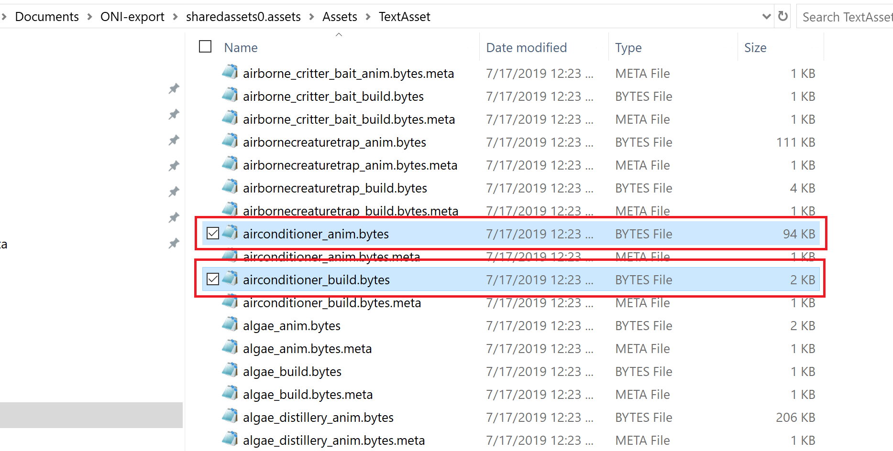
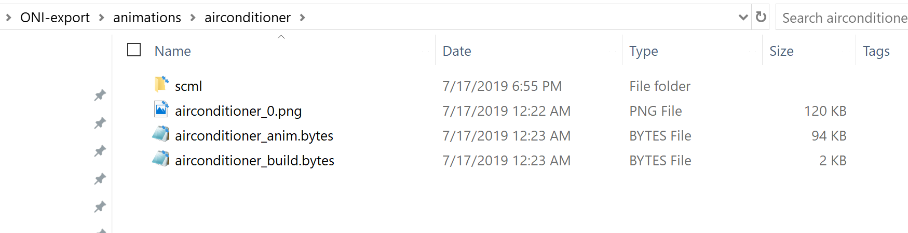
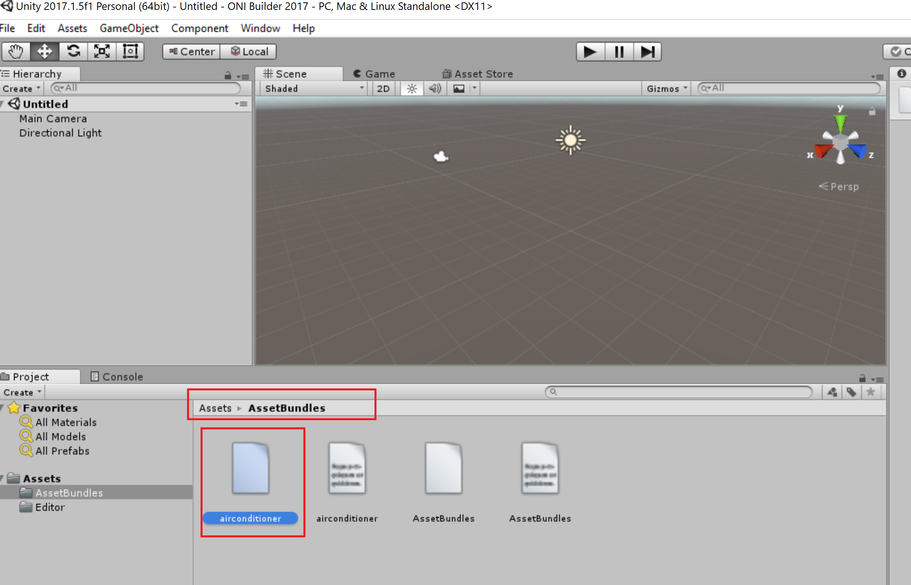

# K-Parser

A bidirectional converter between scml projects and klei animation files.

For the direction (klei animation files -> scml project) this tool must be used in tandem with a unity asset extractor. You will have to use the asset extractor to get the game files - specifically you are looking for the
atlas file (a single png that contains image data for an animation) and the corresponding (they have the same name)
`*.build` and `*.anim` file. Then this tool can convert that into an scml project.

For the direction (scml project -> klei animation files) this tool must be used in tandem with an actual full unity
install. Use version 2018 because that is the version that Oxygen not included runs on. This is because after this
tool creates the klei animation files from your scml project you will need to use unity to create an asset bundle
that contains the atlas file (`*.png` file), the build file (`*.build`) and the animation file (`*.anim`).

The conversion from (klei animation files -> scml project) is a lossy conversion because klei animation format is more powerful than spriter (main limitation is skew transforms aren't part of spriter). But the conversion from (scml project -> klei animation file) is correct.

Both directions have been tested and confirmed to work. A more clear tutorial on how to use this tool to create asset mods for Oxygen not included will be made.

## Spriter Project Warning - IMPORTANT - MUST READ
Because of limitations of the klei animation format you cannot convert all Spriter projects to klei animations. The requiremets for a Spriter project to be converted to a klei animation are listed here. If you do not **exactly** follow these requirements in your Spriter project it **will not** convert to a klei animation properly and you will be sad and I will be unable to help.
* Name all of your image files with an underscore and a number at the end. For example if you have an image `blob.png` instead name it `blob_0.png`. The numbering for an individual sprite must start at 0. If you had two different versions of `blob` you would name them `blob_0.png` and `blob_1.png`. If you have separate sprites they each start at 0, for example `blob_0.png` and `head_0.png`. This is required for how the tool is currently written.
* You absolutely **must** enable snapping for your project. The klei animation format expects your keyframes to be in a specific interval. So if you do not enforce that your Spriter project snaps all keyframes to this interval it will be unable to be converted. To turn on snapping you will need to click the triple dots in the timeline panel for opening the settings and then making sure that the `Enable Snapping` option is checked. Additionally you should make all your animations at 33 ms interval to fit within the game's animation style as that is the interval used by klei's own animations for Oxygen Not Included.

* You absolutely **cannot** utilize Spriter's feature of setting a pivot point on individual sprites on individual keyframes. What is meant by this is: klei's animation format expects every sprite to have a specific consistent pivot point across the entire animation, i.e. the pivot point of a sprite never changes in a klei animation. As such if you were to change the pivot point of a sprite in your animation (do note that this ability is supported by Spriter which is why you must be so careful to avoid doing it) you simply cannot! This is because there is no way to convert a moving pivot point in Spriter to a consistent pivot in a klei animation. It is not mathematically possible to do so. What you want to do for setting the pivot properly is to set it once for every sprite by setting it in the palette window **before** dragging any of the sprites into your animation.

* Below is example of modifying the pivot on an individual sprite. This is an example of what you **should not** do. The red box shows the pivot location after manually moving it on an individual sprite. If you do not move the pivot on the sprite manually it will be a red circle instead of the grey circle.

## Usage Guide

### Extracting an SCML Project

1. Install uTinyRipper from [here](https://github.com/mafaca/UtinyRipper).

2. Extract uTinyRipper from the zip file

3. Run uTinyRipper from the exe file

4. With uTinyRipper running open your file system and navigate to your OxygenNotIncluded_Data folder. On Windows it should be located at "C:\Program Files (x86)\Steam\steamapps\common\OxygenNotIncluded\OxygenNotIncludedData". You are looking for "sharedassets0.assets", "sharedassets1.assets", and "sharedassets2.assets"

5. Now you will need to drag and drop "sharedassets0.assets" onto your uTinyRipper application window.

6. Now your uTinyRipper should look like this with a large export button in the middle. When you click this button it will prompt you to find a location to put the exported files in. I would recommend putting it in a new folder called "ONI-Exports" under your user's "Documents" directory.

7. After uTinyRipper has exported "sharedassets0.assets" you may go ahead and export the the other two "sharedassets" files or you can leave that for later and continue with the tutorial for now. You will need to bring up that directory in which your exported the ONI game files.

8. In the "Assets" folder of one of the "sharedassets" directories you will find two folders. These are "TextAsset" and "Texture2D". A Klei animation is composed of three files - 1st an image file that contains the raw picture data for the animation (this is considered a Texture2D), 2nd and 3rd are two binary files called the build and animation files (both are considered a TextAsset).

9. Now we can actually bring together all the files that make up a Klei animation. For this example we will look at the Klei animation called "airconditioner". In the game, this animation is used for the building called the "Thermo Regulator". The files you will need for the "airconditioner" animation are "Texture2D/airconditioner_0.png", "TextAsset/airconditioner_build.bytes", and "TextAsset/airconditioner_anim.bytes".

10. All of the files for the "airconditioner" animation together looks like this.

11. Now download the jar version of K-Parser from the releases section of this github repository. Click [here](https://github.com/daviscook477/kparser/releases) to download it. Put the jar somewhere useful. I recommend putting it near your folder containing the animation files.

12. For this next step you will need to be using at least java 9. Run the jar file with the animation files as the parameters to create the scml file. Note the order of the parameters. They must be in this order: image, build, anim.

13. Now you will have the "scml" project file contained inside the new "scml" directory. Additional the original texture file will have been split into its component pieces.

14. Next open the scml file in [Spriter](https://brashmonkey.com/). You can now examine and edit the Klei animation as a spriter project.

### Compiling Klei Animation Files
1. Assuming you have K-Parser installed already (if not see step 11 of the scml extraction section of this tutorial) it is simple to run the compiler on the single scml file.

2. Now you will have created your three Klei animation files in the same directory as the scml project.

3. The final step before you can use this new animation you have created in an ONI mod is to create an AssetBundle from these three files. This is the part that requires you to have full install of unity to do it. Unity versions 2018.3.0f2 and 2017.1.5f1 are confirmed to work. Any 2019 Unity version will fail so do not use that version of unity.
4. Create a new 3d unity project and look at the assets panel in the bottom. It will be empty.

5. Follow this [Unity tutorial](https://docs.unity3d.com/Manual/AssetBundles-Workflow.html) starting at the **Build the AssetBundles** header to get your Unity setup to create asset bundles.
6. Once that is done you now should have your assets panel look like this with the "Editor" folder.

7. Now copy your compiled Klei Animation files into the Unity Assets folder.

8. Next you must assign the files to an AssetBundle. Using the AssetBundle menu in the bottom right of the screen create a new AssetBundle with whatever name you want.

9. This is what it will look like once you have assigned an AssetBundle to each of the files. Assign the three files to the **same** asset bundle.

10. Finally right click to open the menu and then select "Build AssetBundles"

11. You AssetBundle will have been created in a new directory called "AssetBundles"

12. The last step is to copy the generated assetbundle file from the "AssetBundles" folder in your temporary Unity project to the "anims" folder of your mod. All animations in assetbundles that are placed in the "anims" folder will automatically be loaded as Klei animations in ONI that are available with an id that is the same as the name of the assetbundle file that you created.

